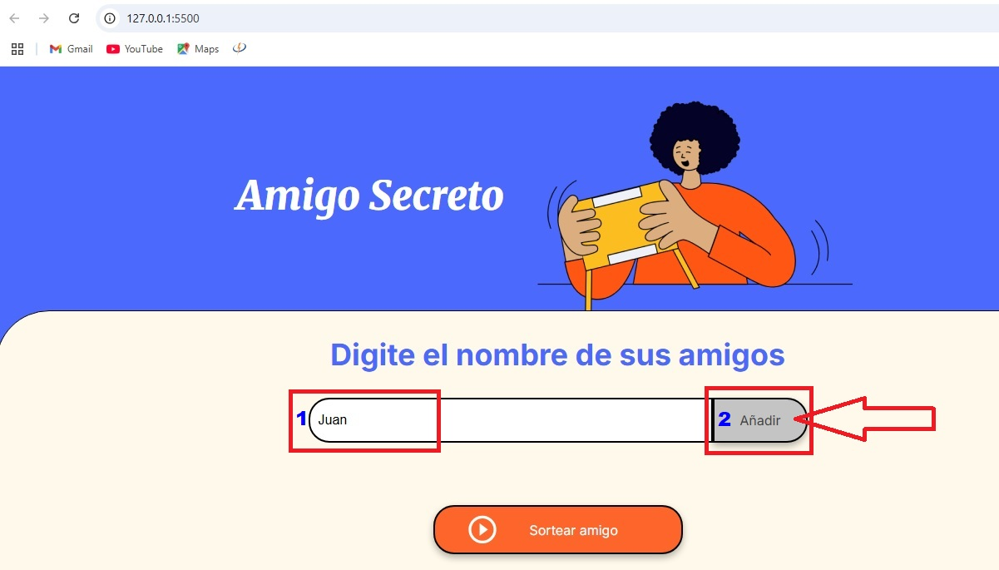
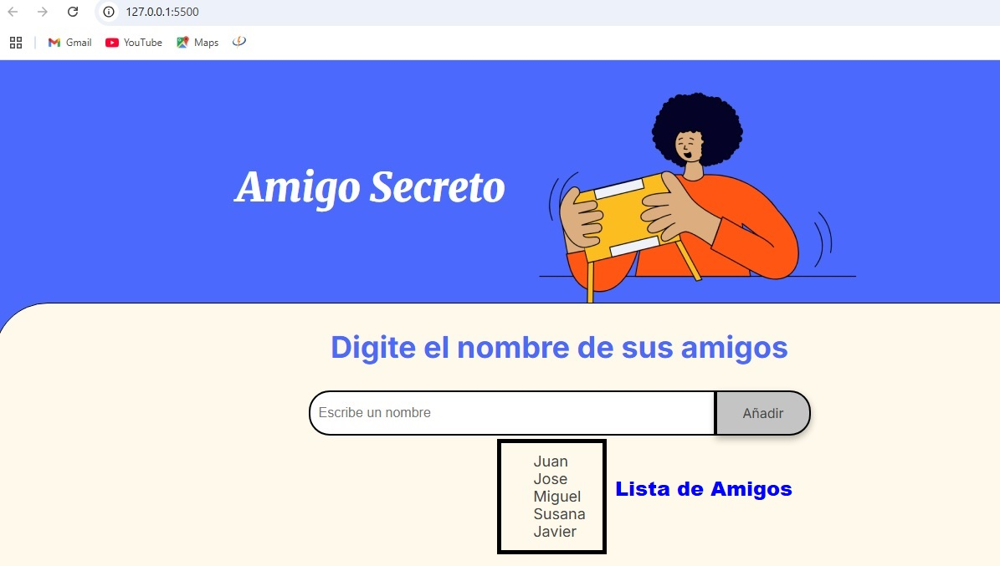
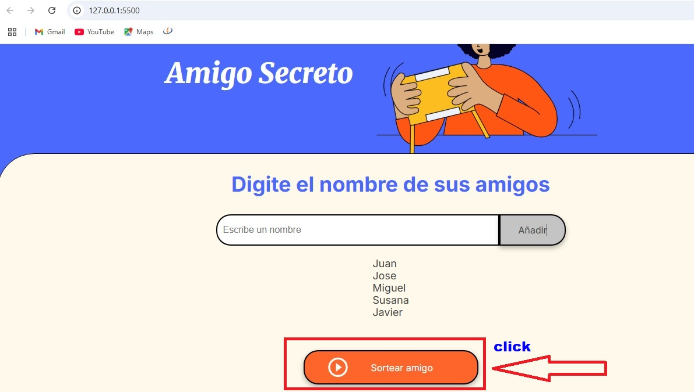
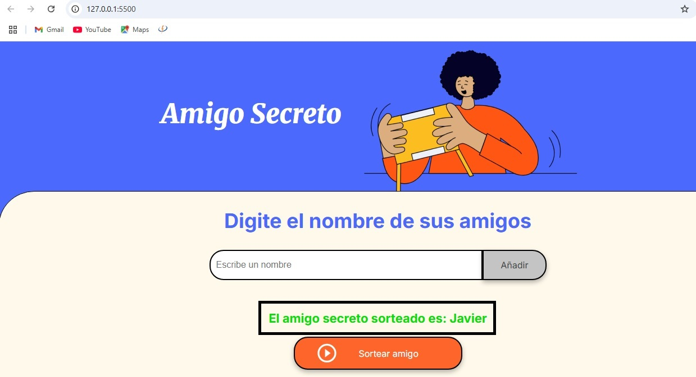
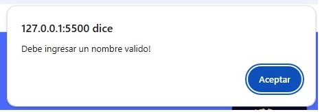
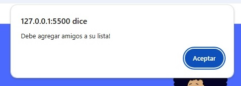

# Challenge Amigo Secreto

## Presentación
El Desafío Amigo Secreto es un paso importante para el éxito en el programa ONE. A través de la práctica y el perfeccionamiento de la lógica de programación, podrás consolidar tus conocimientos, dominar el pensamiento lógico, mejorar tus habilidades de análisis y resolución de problemas, y ampliar tu perspectiva en el mundo del desarrollo.
Con este desafío colocarás en práctica conceptos fundamentales de lógica de programación como variables, condicionales, funciones, listas y lazos de repetición; estos conceptos constituyen la base de cualquier lenguaje de programación, independientemente de su complejidad.
## Tecnologias Utilizadas
   Javascript   
   CSS  
   HTML  
## Funcionalidad
1. Debe escribir el nombre de un amigo en la caja de texto y luego pulsar Añadir.

2. Los nombres de tus amigos se iran agregando a una Lista.

3. Debera pulsar el Botón Sortear amigo para que el sistema seleccione un amigo al azar.

4. El sistema mostrara el nombre del amigo secreto elegido.

Avisos!!  

